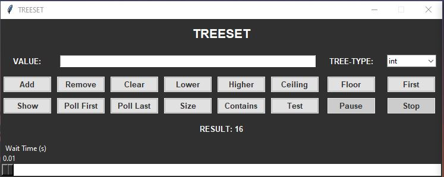
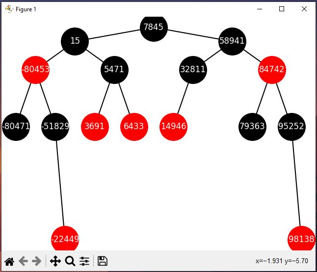

# GUI for visualizing Red-Black Tree

This is a project developed in Python as part of a Data Structure subject belonging to the Conmputer Sciencie degree of the U.L.P.G.C. University for helping to visualize the main developed class, a TreeSet. The GUI could be modified is wanted to visualize other type of trees or structures. Inside the DefaultGUI package can be found the skeleton of the GUI without any functionality implemented.

# Description and fucntionalities

When executing the tree_gui.py file a little windows will appeared on the screen, allowing the user select the type of the tree and operate over it via several buttons. A message will be shown when interacting with the tree allowing the user to know what happened in every time.

# GUI visualization

# Authors

Developed by:
- Javier Castilla
